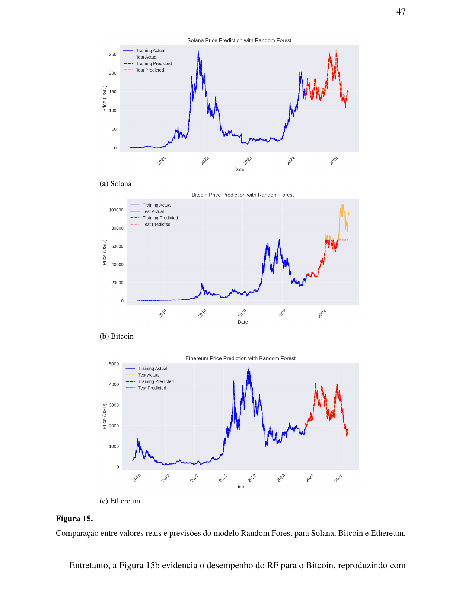
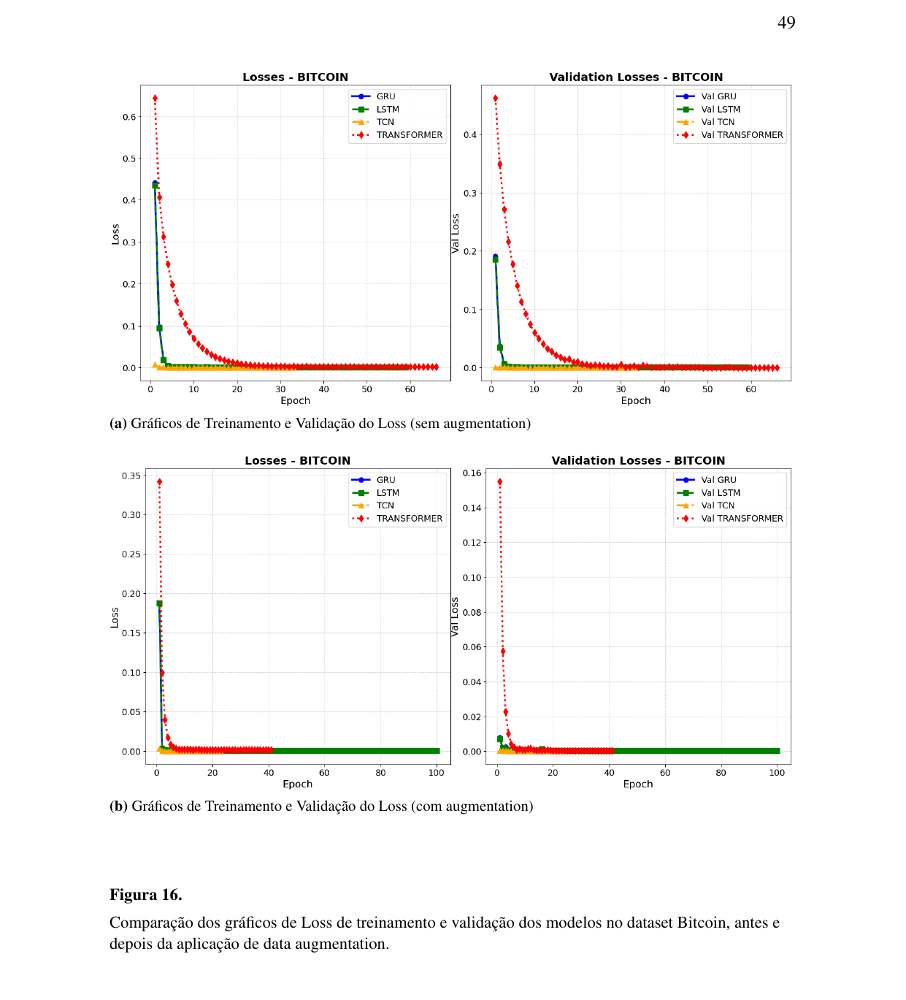
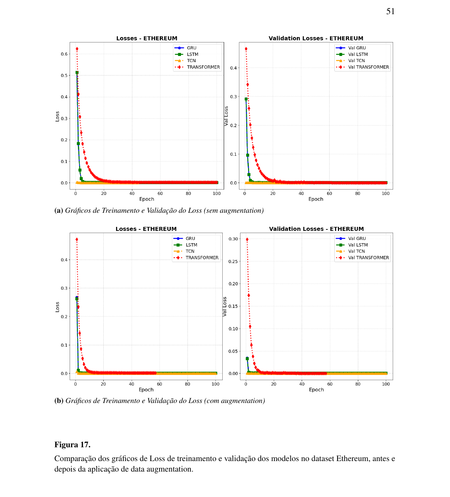
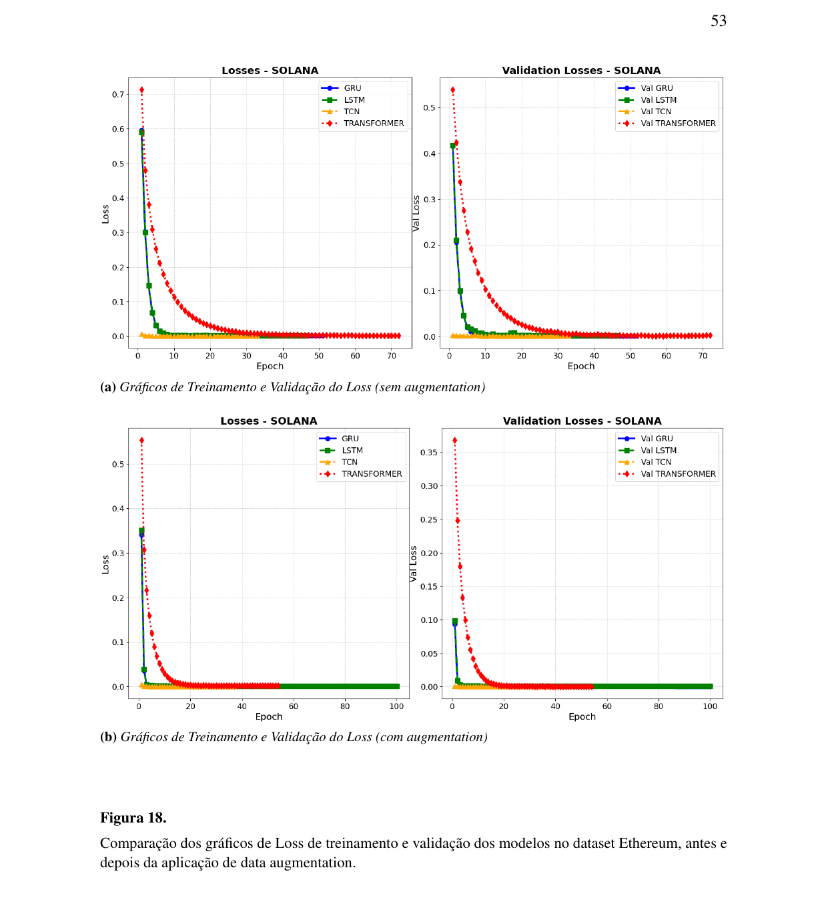

# DeepCoin — Data Analysis

Comparative study of Machine Learning and Deep Learning algorithms for cryptocurrency price prediction. This folder contains the notebooks and results behind the DeepCoin thesis and the EPIA 2026 paper.

## Dataset

Historical daily OHLCV (open, high, low, close, volume) price series for **Bitcoin**, **Ethereum**, and **Solana**, sourced from Yahoo Finance.

The notebooks were run on **Kaggle**, reading from the `cryptocurrency` Kaggle dataset:

```
/kaggle/input/cryptocurrency/bitcoin_historical_yahoo.csv
/kaggle/input/cryptocurrency/ethereum_historical_yahoo.csv
/kaggle/input/cryptocurrency/solana_historical_yahoo.csv
```

> Add the actual dataset link here (Kaggle dataset URL) once published, so anyone can attach it to their own notebook and reproduce the results.

## Notebooks

### `01_random_forest.ipynb`
Baseline classical ML model.
- Loads the OHLCV series and selects `open, high, low, close, volume` as features, `close` as target.
- 80/20 chronological train/test split (no shuffling, to respect time order).
- Feature and target scaling with `MinMaxScaler`.
- Trains a `RandomForestRegressor` and evaluates it with MAE, RMSE, and R².

### `02_deep_learning.ipynb`
Deep learning models and the augmentation experiment.
- Loads all three assets (BTC, ETH, SOL) and builds fixed-length input sequences (`create_sequences`) for supervised time-series learning.
- Implements two data augmentation techniques applied to the training sequences:
  - **Jittering** — adds small random Gaussian noise to the series.
  - **Magnitude warping** — smoothly scales the series using a cubic-spline random curve.
- Builds and trains four architectures: **LSTM**, **GRU**, **TCN** (dilated causal `Conv1D` blocks), and **Transformer** (custom `MultiHeadAttention` blocks with positional encoding).
- Trains each model twice per asset — with and without augmentation — to measure its effect on generalization.
- Evaluates all models with MAE, MAPE, RMSE, and R², and saves metrics/predictions to `results/` for later comparison and plotting.

## Results

The `results/` folder stores the metrics and figures generated by the notebooks:

```
results/
├── metrics/     # JSON/CSV files with MAE, MAPE, RMSE, R² per model, per asset, per condition (with/without augmentation)
└── figures/     # comparison plots (predicted vs. actual, error distributions, etc.)
```

A full discussion of the results is available in the thesis report ([`../docs/relatorio.pdf`](../docs/relatorio.pdf)) and in the EPIA 2026 paper.

## Results

Full discussion is in the thesis report ([`../docs/relatorio.pdf`](../docs/relatorio.pdf), sections 4.1–4.2 and 5). Summary below.

### Random Forest (baseline)

| Cryptocurrency | MAE | RMSE | MAPE | R² |
|---|---|---|---|---|
| Solana | 0.64 | 1.22 | 0.35% | 0.9988 |
| Bitcoin | 6294.85 | 12969.32 | 6.92% | 0.7221 |
| Ethereum | 3.68 | 5.17 | 0.13% | 0.9999 |

RF fit Solana and Ethereum very well. On Bitcoin it tracked the overall trend but underperformed on the sharp post-2024 volatility spikes — pointing to overfitting on training-period patterns and weaker generalization on high-volatility regimes.



### Deep Learning — Bitcoin

| Model | Augmentation | MAE | RMSE | MAPE | R² |
|---|---|---|---|---|---|
| LSTM | No | 7331.66 | 10752.73 | 9.53% | 0.8013 |
| LSTM | Yes | 5117.18 | 8505.45 | 6.34% | 0.8757 |
| GRU | No | 4227.35 | 6510.70 | 5.49% | 0.9272 |
| GRU | Yes | 5448.27 | 9467.43 | 6.56% | 0.8460 |
| **TCN** | **Yes** | **1566.40** | **2293.38** | **2.33%** | **0.9910** |
| TCN | No | 2707.53 | 3464.89 | 4.16% | 0.9794 |
| Transformer | No | 8591.46 | 14547.61 | 10.43% | 0.6364 |
| Transformer | Yes | 8693.70 | 14663.97 | 10.37% | 0.6305 |



### Deep Learning — Ethereum

| Model | Augmentation | MAE | RMSE | MAPE | R² |
|---|---|---|---|---|---|
| LSTM | No | 151.03 | 198.26 | 5.06% | 0.8952 |
| LSTM | Yes | 101.14 | 138.36 | 3.58% | 0.9490 |
| GRU | No | 94.35 | 129.74 | 3.31% | 0.9551 |
| GRU | Yes | 84.52 | 118.39 | 2.96% | 0.9626 |
| **TCN** | **Yes** | **79.20** | **110.74** | **2.77%** | **0.9673** |
| TCN | No | 96.73 | 126.73 | 3.31% | 0.9572 |
| Transformer | No | 92.94 | 124.34 | 3.25% | 0.9588 |
| Transformer | Yes | 79.78 | 112.07 | 2.77% | 0.9665 |



### Deep Learning — Solana

| Model | Augmentation | MAE | RMSE | MAPE | R² |
|---|---|---|---|---|---|
| LSTM | No | 11.05 | 15.13 | 6.24% | 0.8416 |
| LSTM | Yes | 8.17 | 10.85 | 4.95% | 0.9185 |
| GRU | No | 7.79 | 10.32 | 4.61% | 0.9263 |
| GRU | Yes | 7.32 | 9.69 | 4.40% | 0.9350 |
| **TCN** | **Yes** | **6.47** | **8.63** | **3.85%** | **0.9485** |
| TCN | No | 6.93 | 9.37 | 4.06% | 0.9393 |
| Transformer | No | 8.41 | 11.26 | 4.81% | 0.9122 |
| Transformer | Yes | 7.05 | 9.29 | 4.16% | 0.9403 |



### Key takeaways

- **TCN was the most consistent model overall**, achieving the lowest error and highest R² on all three assets, especially after data augmentation — evidence that dilated causal convolutions capture short-term price patterns well across different volatility regimes.
- **Data augmentation (jittering + magnitude warping) improved LSTM and GRU** across the board, and improved the Transformer on Ethereum and Solana. On Bitcoin, augmentation helped LSTM but not the Transformer, which remained the weakest model on that asset in both scenarios.
- **Random Forest is a strong, cheap baseline** for lower-volatility assets (Ethereum, Solana), but a deep learning model — particularly TCN — is a better fit when volatility is high (Bitcoin).
- All models trained without visible overfitting/underfitting (loss and validation loss curves converge together in all three datasets).

## How to reproduce

**Option A — Kaggle (recommended, matches the original setup):**
1. Create a new Kaggle notebook.
2. Attach the `cryptocurrency` dataset (or upload your own OHLCV CSVs with the same column names: `date, open, high, low, close, volume`).
3. Upload/copy the notebook (`01_random_forest.ipynb` or `02_deep_learning.ipynb`) and run all cells. A GPU accelerator is recommended for `02_deep_learning.ipynb`.

**Option B — Local environment:**
```bash
cd data-analysis
python -m venv venv
source venv/bin/activate        # Windows: venv\Scripts\activate
pip install -r requirements.txt
```
Then update the dataset paths inside the notebooks from `/kaggle/input/cryptocurrency/...` to your local CSV paths, and run them with Jupyter:
```bash
jupyter notebook notebooks/
```

## Notes

- Random seeds are fixed (`SEED = 42`) for reproducibility across runs.
- Trained model artifacts (`.h5`, `.joblib`) are not versioned here — see [`../web-app/README.md`](../web-app/README.md) for how they're loaded into the dashboard.